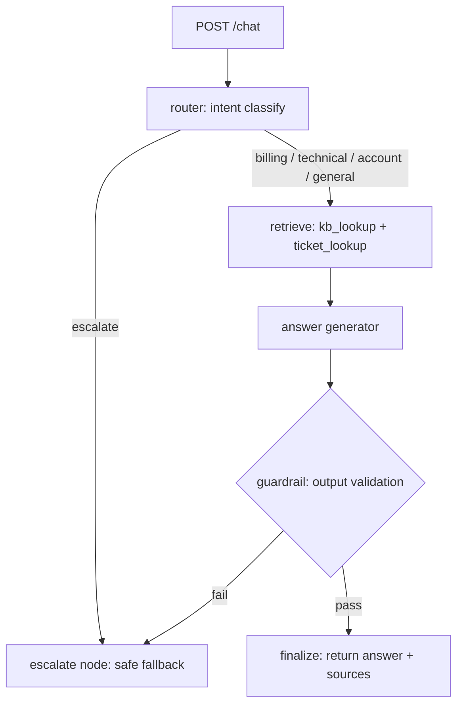

# LangGraph Support Agent

A customer-support copilot built as a **LangGraph state machine**: intent router → knowledge-base + ticket tools → answer generator → guardrail/output-validation → answer or escalate. Served over FastAPI, traced with LangSmith, deployable via Docker/Helm/Argo CD.

> **Honesty notes:** all bundled docs and tickets are **synthetic demo data**. The service runs in **mock mode by default** (deterministic fake LLM, no keys, no cost) and is a reference implementation — not deployed to production, no business metrics claimed. Live AWS Bedrock calls are supported but were not exercised here (no AWS credentials in this environment).

## Architecture



**Nodes**
- `router` — classifies intent (`billing`, `technical`, `account`, `general`, `escalate`) via the LLM.
- `retrieve` — BM25 lookup over bundled docs (`kb_lookup`) + ticket lookup by ID/keyword (`ticket_lookup`).
- `answer` — generates the answer grounded only in retrieved sources.
- `guardrail` — validates the draft (non-empty, length cap, no prompt-marker leakage); failures route to `escalate`.
- `escalate` / `finalize` — terminal nodes.

**Observability:** LangSmith tracing is enabled automatically when `LANGSMITH_API_KEY` is present (Secrets Manager or env); the app degrades gracefully without it.

**Secrets:** all secrets load from **AWS Secrets Manager** (`support-agent/config` JSON: `LANGSMITH_API_KEY`, `BEDROCK_MODEL_ID`) with env-var fallback for local dev. No secrets are stored in code, tests, or git history.

## Measured results

Measured locally on 2026-09-23 (mock LLM, synthetic bundled data):

| Check | Result |
|---|---|
| pytest suite | **14/14 passed** |
| Golden-set eval (`eval/run_eval.py`, 8 cases: routing + answer grounding) | **8/8 passed** |
| `POST /chat` latency, n=15, local uvicorn | **p50 5.01 ms**, p95 5.98 ms |

## Setup

```bash
python -m venv .venv && source .venv/bin/activate
pip install -r requirements.txt
```

Mock mode (default, no keys needed):
```bash
MOCK_MODE=true python -m uvicorn support_agent.api:app --port 8000
```

Live Bedrock mode:
```bash
export MOCK_MODE=false AWS_REGION=us-east-1 BEDROCK_MODEL_ID=anthropic.claude-3-5-sonnet-20241022-v2:0
# key via AWS Secrets Manager secret "support-agent/config" or env LANGSMITH_API_KEY
python -m uvicorn support_agent.api:app --port 8000
```

## Usage

```bash
curl -X POST localhost:8000/chat -H 'Content-Type: application/json' \
  -d '{"message": "I was charged twice on my last invoice"}'
# {"answer": "According to our documentation (Billing and charges, ...) ...",
#  "intent": "billing", "escalated": false,
#  "sources": ["Billing and charges", ...], "tools_used": ["kb_lookup"], "latency_ms": 5.2}

curl -X POST localhost:8000/chat -H 'Content-Type: application/json' \
  -d '{"message": "I want to speak to a human"}'
# -> escalated: true, safe handoff message
```

## API reference

| Method | Path | Description |
|---|---|---|
| `GET` | `/health` | Liveness; reports `mock_mode` |
| `POST` | `/chat` | `{"message": str (1–2000 chars), "session_id"?: str}` → `{"answer", "intent", "escalated", "sources", "tools_used", "latency_ms"}` |

Request validation is enforced by Pydantic; the serving layer re-validates agent output (non-empty, length-capped) before responding.

## Deployment

**Docker** (multi-stage, non-root):
```bash
docker build -t ghcr.io/saimudunuri04/langgraph-support-agent:latest .
docker run -p 8000:8000 ghcr.io/saimudunuri04/langgraph-support-agent:latest
```

**Helm:**
```bash
helm lint helm/support-agent
helm template release helm/support-agent --namespace ai-agents
helm upgrade --install support-agent helm/support-agent --namespace ai-agents --create-namespace
```
Default image: `ghcr.io/saimudunuri04/langgraph-support-agent:latest` (see `helm/support-agent/values.yaml`).

**Argo CD (GitOps):** `argocd/application.yaml` syncs `helm/support-agent` with automated sync, prune, and self-heal.

**End-to-end loop:** `git push` to `main` → GitHub Actions runs pytest + golden eval (`.github/workflows/ci.yml`) → on green, `cd.yml` builds the Docker image and pushes `:sha` + `:latest` to GHCR → Argo CD detects the new image and rolls it out.

## Project structure

```
support_agent/        # router/retriever/answer/guardrail graph, tools, LLM backends, API
data/docs/            # synthetic knowledge-base articles (7)
data/tickets.json     # synthetic ticket records (5)
eval/                 # golden-set eval (8 cases) + runner
scripts/              # latency measurement
tests/                # pytest suite (tools, graph, API)
helm/support-agent/   # Helm chart (deployment, service, serviceaccount)
argocd/               # Argo CD Application manifest
.github/workflows/    # CI (tests+eval) and CD (build+push to GHCR)
```

## CI status

`ci.yml` runs pytest + the golden eval on every push/PR (mock mode, no secrets). `cd.yml` builds and pushes the image to GHCR on merge to `main` after tests pass.
